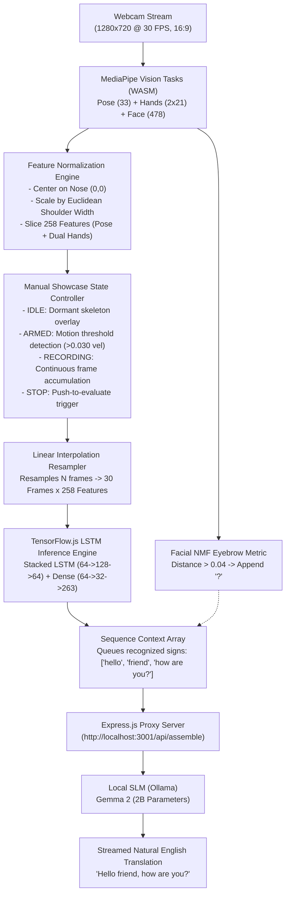

# SignAI: Real-Time Indian Sign Language (ISL) Translation Pipeline

[](https://www.tensorflow.org/js)
[](https://developers.google.com/mediapipe)
[](https://react.dev/)
[-black?logo=ollama)](https://ollama.com/)
[](LICENSE)

An end-to-end, edge-accelerated sign language recognition and natural language translation pipeline. SignAI translates continuous and isolated **Indian Sign Language (ISL)** gestures into fluent, grammatical English sentences running **100% locally and offline** with zero cloud dependencies.

---

## 📌 Table of Contents
- [System Architecture](#-system-architecture)
- [Key Features & Engineering Differentiators](#-key-features--engineering-differentiators)
- [Dataset & Augmentation Pipeline](#-dataset--augmentation-pipeline)
- [Vocabulary (263 Classes)](#-vocabulary-263-classes)
- [Project Folder Structure](#-project-folder-structure)
- [Getting Started](#-getting-started)
  - [Prerequisites](#prerequisites)
  - [1. Backend Setup (Local Ollama SLM)](#1-backend-setup-local-ollama-slm)
  - [2. Frontend Setup (React + Vite)](#2-frontend-setup-react--vite)
  - [3. Model Retraining (Optional)](#3-model-retraining-optional)
- [Showcase & Live Demo Guide](#-showcase--live-demo-guide)

---

## 🧠 System Architecture



---

## 🚀 Key Features & Engineering Differentiators

### 1. 100% Offline, Client-Side Edge Inference
* Computer vision tracking (MediaPipe WASM) and temporal classification (TensorFlow.js WebGL) execute completely inside the client's browser.
* Sentence assembly runs through a local Small Language Model (Gemma 2 2B via Ollama). No external cloud APIs, no recurring costs, and zero network latency.

### 2. Invariant Spatial Normalization
* **Nose-Centric Coordinate Space**: All spatial coordinates are centered relative to the nose tip (index 0).
* **Shoulder-Width Scaling**: Coordinates are divided by the Euclidean distance between Left Shoulder (`idx 11`) and Right Shoulder (`idx 12`):
  $$\text{Scale} = \sqrt{(x_{\text{l\_sh}} - x_{\text{r\_sh}})^2 + (y_{\text{l\_sh}} - y_{\text{r\_sh}})^2}$$
  Signers can stand close to or far from the camera without altering the model input tensor.

### 3. Aspect-Ratio Calibration (16:9 Widescreen)
* The webcam feed is locked to **1280×720 (16:9)** to match the training dataset's native 1080p geometry.
* Standard 4:3 webcams (640×480) distort normalized coordinates, causing vertical motion compression that breaks LSTM trajectory recognition.

### 4. Dual-Hand Exponential Smoothing & Grace-Period Memory
* An Exponential Moving Average ($\alpha = 0.65$) dampens high-frequency camera noise.
* A **3-frame grace-period buffer** retains hand coordinates when tracking momentarily drops, preventing coordinates from teleporting to `(0, 0)` and corrupting the LSTM velocity memory.

### 5. 258-Feature Vector (Face Mesh Trimming)
* Raw MediaPipe output includes 1,434 facial mesh coordinates.
* The feature vector trims out all facial mesh points to prevent the LSTM from memorizing actor identities and facial quirks, retaining only:
  $$\text{Vector Length} = 132 \ (\text{Pose: } 33 \times 4) + 63 \ (\text{Left Hand: } 21 \times 3) + 63 \ (\text{Right Hand: } 21 \times 3) = 258$$

### 6. Non-Manual Feature (NMF) Question Heuristic
* Evaluates vertical displacement between eyebrow and eye landmarks:
  $$\Delta_{\text{brow}} = \frac{|y_{105} - y_{159}| + |y_{334} - y_{386}|}{2.0}$$
* When $\Delta_{\text{brow}} > 0.04$, the system flags the gesture as an interrogative and appends a `?` token.

### 7. Strict Manual Push-to-Record Showcase Mode
* Designed specifically for live presentations to eliminate false-positive hallucinations:
  1. **Idle**: The app is dormant; no auto-guessing can occur.
  2. **Push to Arm (Spacebar / Click)**: Turns yellow (*"Waiting for motion..."*).
  3. **Move to Record**: Activates automatically when hand velocity crosses $0.030$, turning red (*"Stop"*).
  4. **Push to Stop**: User explicitly stops the sign. The sequence is resampled to 30 frames and evaluated.

---

## 📊 Dataset & Augmentation Pipeline

* **Data Source**: Zenodo Indian Sign Language (ISL) Full-HD Dataset (44 multi-part zip archives processed via `download_and_extract.py`).
* **Format**: 1080p (1920×1080), 25–30 FPS, studio lighting.
* **Augmentation (8× Expansion)** (`phase2_train_lstm.py`):
  1. **Gaussian Jitter**: Zero-mean noise ($\sigma = 0.005$) added to joints.
  2. **Scale Variation**: Uniform random spatial scaling $\in [0.92, 1.08]$.
  3. **Non-Linear Time Warping**: Piecewise linear stretching and compression across frames to simulate signing speed variations.
  4. **Horizontal Mirroring**: Inverts $X$-coordinates and swaps left/right hand buffers for ambidextrous recognition.
  5. **Boundary Trimming**: Randomly crops 0–4 frames from edges and linearly interpolates back to 30 frames.

---

## 📖 Vocabulary (263 Classes)

The model is trained on **263 total output classes** (262 ISL glosses + 1 idle class):

| Category | Words / Signs |
| :--- | :--- |
| **Greetings & Civics** | `hello`, `how are you`, `good morning`, `good afternoon`, `good evening`, `good night`, `thank you`, `pleased`, `sign` |
| **People & Family** | `mother`, `father`, `parent`, `son`, `daughter`, `brother`, `sister`, `grandfather`, `grandmother`, `husband`, `wife`, `baby`, `child`, `adult`, `man`, `woman`, `boy`, `girl`, `family`, `neighbour`, `friend` |
| **Pronouns** | `i`, `you`, `he`, `she`, `it`, `we`, `they`, `you (plural)` |
| **Professions** | `doctor`, `teacher`, `student`, `lawyer`, `artist`, `author`, `manager`, `reporter`, `actor`, `soldier`, `police`, `priest`, `secretary`, `waiter`, `player` |
| **Emotions & States** | `happy`, `sad`, `beautiful`, `ugly`, `alive`, `dead`, `sick`, `healthy`, `strong`, `weak`, `rich`, `poor`, `famous` |
| **Colors** | `red`, `green`, `blue`, `yellow`, `brown`, `pink`, `orange`, `black`, `white`, `grey`, `colour` |
| **Time & Calendar** | `today`, `tomorrow`, `yesterday`, `week`, `month`, `year`, `hour`, `minute`, `second`, `morning`, `afternoon`, `evening`, `night`, `sunday` – `saturday` |
| **Places & Buildings** | `house`, `school`, `hospital`, `library`, `office`, `university`, `market`, `store or shop`, `park`, `temple`, `court`, `bank`, `restaurant`, `city`, `train station` |
| **Transport & Objects**| `car`, `bus`, `truck`, `bicycle`, `boat`, `train`, `plane`, `computer`, `laptop`, `screen`, `camera`, `television`, `radio`, `cell phone`, `telephone`, `book`, `pen`, `pencil`, `paper`, `money`, `key` |
| **Animals** | `dog`, `cat`, `cow`, `horse`, `bird`, `fish`, `animal` |
| **Abstract & Concepts**| `peace`, `war`, `religion`, `energy`, `god`, `technology`, `science`, `marriage`, `dream`, `india`, `extra` |

---

## 📁 Project Folder Structure

```
Ai_sign_language_translator-/
├── .env                              # Environment configuration
├── Logs/                             # TensorBoard training metrics & loss curves
├── MP_Data/                          # Processed numpy sequences (30 frames x 258 features)
├── backend/                          # Express.js local SLM proxy
│   ├── package.json
│   └── server.js                     # Ollama streaming connector (port 3001)
├── frontend/                         # React 19 + Vite dashboard
│   ├── public/
│   │   └── models/                   # Web-hosted TFJS artifacts
│   │       ├── labels.json           # 263 class index mappings
│   │       ├── model.json            # TFJS topology
│   │       └── group1-shard1of1.bin  # Quantized weights (960 KB)
│   ├── src/
│   │   ├── App.jsx                   # Vision pipeline, state machine & UI
│   │   ├── DemoMode.jsx              # Presentation showcase module
│   │   ├── index.css                 # Cyber-minimal styling
│   │   └── main.jsx
│   ├── package.json
│   └── vite.config.js
├── models/
│   └── action.h5                     # Trained Keras model
├── download_and_extract.py           # Zenodo 1080p ISL downloader & extractor
├── phase1_keypoint_extractor.py      # MediaPipe video landmark extractor
├── phase2_train_lstm.py              # 8x augmentation & LSTM training script
├── requirements.txt                  # Python dependencies
└── README.md                         # Documentation
```

---

## 💻 Getting Started

### Prerequisites
* **Node.js** (v18.0.0 or higher)
* **Python** (3.10+ if retraining models)
* **Ollama** installed with `gemma2:2b`:
  ```bash
  ollama run gemma2:2b
  ```

### 1. Backend Setup (Local Ollama SLM)
```bash
cd backend
npm install
npm start
```
*Backend runs on `http://localhost:3001` and connects directly to `http://127.0.0.1:11434`.*

### 2. Frontend Setup (React + Vite)
```bash
cd frontend
npm install
npm run dev
```
*Open `http://localhost:5173` in your browser.*

### 3. Model Retraining (Optional)
To retrain or fine-tune the model on new keypoint data:
```bash
# Extract keypoints from raw videos in MP_Data
python3 phase1_keypoint_extractor.py

# Train LSTM with 8x data augmentation and auto-export to TFJS
python3 phase2_train_lstm.py
```

---

## 🎯 Showcase & Live Demo Guide

To demonstrate the system flawlessly in live presentations:

1. **Record a Word**:
   * Click **"● Record Next Sign (Spacebar)"** (the button turns **Yellow**: *"Waiting for motion..."*).
   * Perform the sign. The button turns **Red** (*"Stop"*).
   * Once finished, click **"Stop"** (or hit Spacebar).
   * The predicted word appears in the **Sequence Context** panel.
2. **Build a Sentence**:
   * Repeat step 1 for 2–4 words (e.g., `Hello` $\rightarrow$ `Friend` $\rightarrow$ `How are you?`).
3. **Assemble with Local SLM**:
   * Click the blue **"◼ Finish & Translate"** button.
   * The local Gemma 2 model will stream the translated sentence (*"Hello friend, how are you?"*) and clear the context for the next sign!
