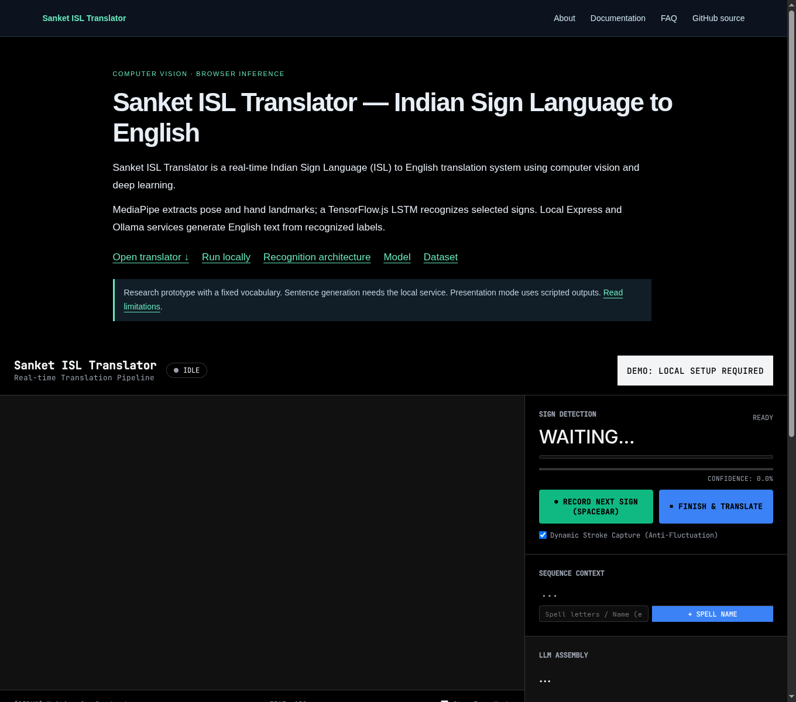
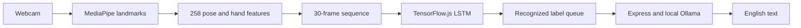

# Sanket ISL Translator

> Sanket ISL Translator is a real-time Indian Sign Language (ISL) to English translation system using computer vision and deep learning.

It connects webcam-based MediaPipe pose and hand landmark detection to a TensorFlow.js LSTM classifier and generates English text from recognized labels through local Express and Ollama. Sanket is a research prototype for selected ISL signs, not unrestricted conversational interpretation. Browser inference and sentence generation are separate stages, and the presentation demo uses scripted words rather than measured recognition.

- **Live demo:** not deployed yet; [run locally](docs/installation.md).
- **GitHub:** [Sanket ISL Translator source repository](https://github.com/ujjwal-tiwari3039/Sanket-ISL-translator).
- **Documentation:** [technical documentation index](docs/index.md).
- **Technical details:** [architecture](docs/architecture.md), [model](docs/model.md), [dataset](docs/dataset.md).
- **Screenshot:** [translator interface with camera disabled](apps/frontend/public/screenshots/translator.png); [demo behavior](docs/how-it-works.md).
- **Installation:** [setup and usage](docs/installation.md).

[](apps/frontend/package.json)
[](apps/frontend/package.json)
[](ml/src/training/train_lstm.py)



*Actual local interface capture, 2026-09-20. Camera disabled; this image is not recognition evidence.*

## What is Sanket ISL Translator?

Real-time Indian Sign Language (ISL) to English translation using computer vision and deep learning. Sanket recognizes a restricted vocabulary from temporal pose and hand features, then produces English language output from the accepted label sequence.

## Why Sanket Exists

Sanket provides a practical software project for exploring ISL recognition, browser-based AI and English sentence generation. It is intended for engineering experimentation and research; user benefit and accessibility outcomes have not been independently measured.

## Features

- Live webcam overlays and user-armed gesture capture.
- Spatial normalization and fixed-length temporal classification.
- Ranked candidate labels and sequence context.
- Local Ollama sentence generation with a basic text fallback.
- Scripted video presentation mode, explicitly separate from live inference.

## How It Works and System Architecture



[Architecture and network boundaries](docs/architecture.md) explain each component. The [processing guide](docs/how-it-works.md) distinguishes recognition from translation.

## Computer Vision Pipeline and Preprocessing

MediaPipe estimates pose, hands and face. The classifier uses 132 pose and 126 hand values; face coordinates are removed. x/y coordinates are centered on the nose and scaled by shoulder distance. Live captures are interpolated to 30 frames. Face landmarks also feed a separate question heuristic. See [preprocessing](docs/preprocessing.md).

## Sign Recognition Model and Training

Three LSTM layers (64 → 128 → 64 units), three Dropout layers (0.4), and Dense layers (64 → 32 → 263) form a 245,831-parameter classifier. The trainer configures Adam at 0.0005, categorical cross-entropy, balanced class weights and early stopping. These configuration values are not a record of a fully reproducible training run. See the [precise model specification](docs/model.md).

## Translation Pipeline

Finish & Translate posts labels to local Express on port 3001. Express merges consecutive single-letter entries and streams `gemma2:2b` output from Ollama. Failed model requests use basic capitalization and punctuation. Natural English generation can alter meaning; it does not validate recognition.

## Dataset

Acquisition scripts reference [INCLUDE on Zenodo](https://zenodo.org/records/4010759). Exact training subset and full source provenance are not established. See [dataset source, license and split limitations](docs/dataset.md).

## Supported ISL Vocabulary

The shipped label mapping contains **263 entries**, with no idle class. This is a model-output count, not a validated sign-recognition guarantee. [Read the full vocabulary](docs/vocabulary.md).

## Inference and Real-Time Processing

Recognition runs in TensorFlow.js in the browser. The camera and processing loop are configured for interactive use, but no measured latency or hardware-specific FPS benchmark is published. See [inference](docs/inference.md).

## Performance

The stored [development classification report](models/training/eval/classification_report.txt) reports rounded accuracy 0.98 over 2,944 evaluated samples. It is not independently reproduced or a live benchmark. Augmentation happens before the split and the held-out data is reused for early stopping and final reporting, so related examples may leak across partitions. No signer-independent accuracy claim is justified. See [evaluation limitations](docs/model.md).

## Privacy and Local / Offline Processing

The reviewed camera path processes frames in the browser and sends recognized text to the local assembly service. MediaPipe assets and fonts are fetched externally. The project is not a verified fully offline application, and no blanket privacy guarantee is made. See [network and privacy details](docs/inference.md).

## Technology Stack

| Layer | Technology |
| --- | --- |
| Frontend/build | React 19, JavaScript, Vite 8, npm |
| Browser recognition | MediaPipe Tasks Vision, TensorFlow.js |
| Sentence service | Node.js, Express 4, local Ollama / Gemma 2 |
| Training | Python, TensorFlow/Keras, NumPy, scikit-learn |
| Extraction | Python, OpenCV, MediaPipe |
| Public documentation | Static HTML generated from Markdown during Vite build |

## Installation and Usage

Use Node.js 22.12 or newer and npm. Start the services in separate terminals:

```bash
# From the repository root
cd apps/backend
npm install
npm start
```

```bash
# From the repository root
cd apps/frontend
npm install
npm run dev
```

Run Ollama and acquire `gemma2:2b` for language-model assembly. Open Vite's printed localhost URL, allow camera access, arm capture, perform a selected sign and review the output. See [complete prerequisites and training caveats](docs/installation.md).

## Project Structure

```text
apps/frontend/src/         React live inference and scripted demo
apps/frontend/public/models/  TensorFlow.js topology, weights and labels
apps/frontend/scripts/     Static documentation generator and checks
apps/backend/server.js     Local Express/Ollama sentence endpoint
ml/src/                    Python landmark extraction, training and inference
models/                    Python model, landmark assets and evaluation
data/                      Data manifests and samples (datasets kept local)
docs/                      Audited technical documentation
project.json               Shared project identity and repository metadata
```

## Limitations

Restricted vocabulary, manually stopped gesture capture, camera/signer variation, limited facial grammar, generated-text errors and evaluation leakage constrain the prototype. No complete interpreter replacement or production-readiness claim is made. [Read the limitations](docs/limitations.md).

## Future Work and Research Notes

Priorities are signer-separated evaluation, source-data lineage, Python/browser preprocessing parity, sentence-fidelity testing and offline dependency packaging. These are proposed work. See [research methodology](docs/research.md) and the [technical article](docs/article.md).

## Citation

Cite the repository with the commit SHA used. No project DOI, agreed scholarly author list or tagged release is verified. See [citation guidance](docs/citation.md). The INCLUDE publication DOI belongs to the dataset, not Sanket.

## License

No project license file is present. The former MIT badge was unsupported and has been removed. Public source access does not establish reuse rights. Dataset and dependency licenses are separate.

## Contributors

Git history records contributions under Sameer Vishwakarma, sameer vishwakarma and samashech; account/name equivalence and scholarly authorship are not inferred. See the [GitHub contributor history](https://github.com/ujjwal-tiwari3039/Sanket-ISL-translator/graphs/contributors).

## Acknowledgements

The project uses MediaPipe, TensorFlow.js, React, Express and Ollama, and references the INCLUDE dataset. These references do not imply institutional affiliation, endorsement or benchmark equivalence.

## Contact

Use [repository issues](https://github.com/ujjwal-tiwari3039/Sanket-ISL-translator/issues) for reproducible technical reports and contribution discussion. No unverified personal contact details are published.

## Deployment and Discoverability

[Deployment instructions](docs/deployment.md) explain stable URLs, static documentation and release checks. Search engines index independently, AI retrieval mechanisms differ, and not all AI systems consume `llms.txt`. Indexing takes time; rankings and citations cannot be guaranteed. GitHub discovery and web discovery are separate, and legitimate external references matter. See [discoverability maintenance](docs/discoverability.md).
