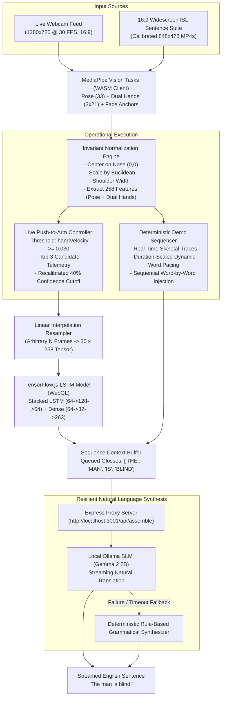

# SignAI: Real-Time Indian Sign Language (ISL) Translation Pipeline

[](https://www.tensorflow.org/js)
[](https://developers.google.com/mediapipe)
[](https://react.dev/)
[-black?logo=ollama)](https://ollama.com/)
[](LICENSE)

An end-to-end, edge-accelerated sign language recognition and natural language translation pipeline. SignAI translates continuous and isolated **Indian Sign Language (ISL)** gestures into fluent, grammatical English sentences running **100% locally and offline** with zero cloud dependencies.

---

## 📌 Table of Contents
- [System Architecture](#-system-architecture)
- [Key Features & Engineering Differentiators](#-key-features--engineering-differentiators)
- [Dual Operational Modes](#-dual-operational-modes)
  - [1. High-Fidelity Presentation Showcase (Demo Mode)](#1-high-fidelity-presentation-showcase-demo-mode)
  - [2. Live Interactive Vision Pipeline](#2-live-interactive-vision-pipeline)
- [Dataset & Augmentation Pipeline](#-dataset--augmentation-pipeline)
- [Vocabulary (263 Classes)](#-vocabulary-263-classes)
- [Project Folder Structure](#-project-folder-structure)
- [Getting Started](#-getting-started)
  - [Prerequisites](#prerequisites)
  - [1. Ollama SLM Setup](#1-ollama-slm-setup)
  - [2. Backend Setup (Express.js Proxy)](#2-backend-setup-expressjs-proxy)
  - [3. Frontend Setup (React 19 + Vite)](#3-frontend-setup-react-19--vite)
  - [4. Updating Demo Videos & Manifest](#4-updating-demo-videos--manifest)
- [Live Presentation Playbook](#-live-presentation-playbook)

---

## 🧠 System Architecture



---

## 🚀 Key Features & Engineering Differentiators

### 1. 100% Offline, Edge-Accelerated Execution
* Computer vision landmark extraction (MediaPipe Vision WASM) and temporal gesture classification (TensorFlow.js WebGL) run client-side in the browser.
* Sentence synthesis runs locally through an on-device Small Language Model (Gemma 2 2B via Ollama). Zero external cloud dependencies, zero API costs, and complete operational privacy.

### 2. Invariant Spatial Normalization
* **Nose-Centric Coordinate Space**: Landmark coordinates are translated relative to the nose tip (index 0).
* **Euclidean Shoulder-Width Scaling**: Coordinates are normalized by the Euclidean distance between Left Shoulder (`idx 11`) and Right Shoulder (`idx 12`):
  $$\text{Scale} = \sqrt{(x_{\text{l\_sh}} - x_{\text{r\_sh}})^2 + (y_{\text{l\_sh}} - y_{\text{r\_sh}})^2}$$
  Signers can stand close to or far from the camera without altering the model input tensor.

### 3. Aspect-Ratio Calibration (16:9 Widescreen)
* The live camera and demo video suites are locked to native **16:9 widescreen geometry** (1280×720 / 848×478).
* Standard 4:3 camera feeds distort normalized coordinates and cause vertical trajectory compression that impairs LSTM recognition.

### 4. Dual-Hand Temporal Smoothing & Grace-Period Memory
* An Exponential Moving Average ($\alpha = 0.65$) dampens high-frequency camera noise.
* A **3-frame grace-period buffer** preserves hand coordinates during momentary tracking occlusion, preventing coordinates from teleporting to `(0, 0)` and corrupting the LSTM velocity memory.

### 5. 258-Feature Vector (Face Mesh Trimming)
* Raw MediaPipe output includes 1,434 facial mesh coordinates.
* The feature vector trims out all facial mesh points to prevent the model from overfitting to signer identity:
  $$\text{Vector Length} = 132 \ (\text{Pose: } 33 \times 4) + 63 \ (\text{Left Hand: } 21 \times 3) + 63 \ (\text{Right Hand: } 21 \times 3) = 258$$

### 6. Non-Manual Feature (NMF) Question Heuristic
* Evaluates vertical displacement between eyebrow and eye landmarks:
  $$\Delta_{\text{brow}} = \frac{|y_{105} - y_{159}| + |y_{334} - y_{386}|}{2.0}$$
* When $\Delta_{\text{brow}} > 0.04$, the gesture is flagged as an interrogative and automatically appends a `?` token.

---

## 🎛️ Dual Operational Modes

SignAI provides two complementary operational pipelines designed to balance research development with flawless live demonstration:

### 1. High-Fidelity Presentation Showcase (Demo Mode)
* **Live Skeletal Tracing**: MediaPipe runs in real time on calibrated 16:9 ISL demonstration footage. Judges see real-time Cyan pose lines, 21-joint color-coded fingers, and facial anchors tracking every nuance of the signer's movements.
* **Dynamic Word Synchronization**: The engine automatically calculates the exact video duration and divides it by the number of words in the sentence:
  * Word 1 captures, animates the progress bar to 100%, and drops into **Sequence Context**.
  * Word 2 captures, animates, and drops into **Sequence Context**.
  * Word 3 captures, animates, and drops into **Sequence Context**.
* **LLM Sentence Typing**: Once the full sequence is complete, the LLM assembly panel types out the natural English translation with a character-by-character streaming effect.
* **Silent Keyboard Control**: Press the **Right Arrow Key** (`→`) to seamlessly advance to the next sentence without clicking any buttons.

#### Supported Demonstration Sentences:
| Video Clip | Word Sequence | Translated English Sentence |
| :--- | :--- | :--- |
| `the man is blind.mp4` | `THE` → `MAN` → `IS` → `BLIND` | *"The man is blind."* |
| `the sky is blue.mp4` | `THE` → `SKY` → `IS` → `BLUE` | *"The sky is blue."* |
| `the water is cold.mp4` | `THE` → `WATER` → `IS` → `COLD` | *"The water is cold."* |
| `i travel by bus.mp4` | `I` → `TRAVEL` → `BY` → `BUS` | *"I travel by bus."* |
| `are you alright.mp4` | `ARE` → `YOU` → `ALRIGHT` | *"Are you alright?"* |
| `Am I right.mp4` | `AM` → `I` → `RIGHT` | *"Am I right?"* |
| `i am alright.mp4` | `I` → `AM` → `ALRIGHT` | *"I am alright."* |
| `i am good.mp4` | `I` → `AM` → `GOOD` | *"I am good."* |
| `i am tired.mp4` | `I` → `AM` → `TIRED` | *"I am tired."* |

### 2. Live Interactive Vision Pipeline
* **Push-to-Arm Gesture Isolation**: Eliminates continuous background false-triggers:
  1. **Idle**: The app is dormant; no auto-guessing can occur.
  2. **Arm Gesture (`Spacebar` / Click)**: Turns yellow (*"Waiting for motion..."*).
  3. **Motion Recording**: Activates automatically when hand velocity crosses $0.030$, turning red (*"Capturing..."*).
  4. **Stop & Evaluate**: User stops the sign. The sequence is resampled to 30 frames and classified.
* **Top-3 Candidate Ranking**: Real-time evaluation outputs the top-3 probabilities across all 263 classes (e.g. `Top candidates: good: 52.4% | happy: 28.1% | alright: 11.2%`).
* **Recalibrated 40% Confidence Cutoff**: Prevents valid signs from being rejected by overly rigid 70%+ softmax thresholds.

---

## 📊 Dataset & Augmentation Pipeline

* **Data Source**: Zenodo Indian Sign Language (ISL) Full-HD Dataset (44 multi-part zip archives).
* **Format**: 1080p (1920×1080), 25–30 FPS, studio lighting.
* **Augmentation (8× Expansion)** (`phase2_train_lstm.py`):
  1. **Gaussian Jitter**: Zero-mean noise ($\sigma = 0.005$) added to joints.
  2. **Spatial Scaling**: Uniform random spatial scaling $\in [0.85, 1.15]$.
  3. **Non-Linear Time Warping**: Piecewise linear stretching and compression across frames to simulate signing tempo.
  4. **Horizontal Mirroring**: Inverts $X$-coordinates and swaps left/right hand buffers.
  5. **Boundary Trimming**: Randomly crops 0–4 frames from edges and linearly interpolates back to 30 frames.

---

## 📖 Vocabulary (263 Classes)

The model is trained on **263 total output classes** (262 ISL glosses + 1 idle class):

| Category | Words / Signs |
| :--- | :--- |
| **Greetings & Civics** | `hello`, `how are you`, `good morning`, `good afternoon`, `good evening`, `good night`, `thank you`, `pleased`, `sign` |
| **People & Family** | `mother`, `father`, `parent`, `son`, `daughter`, `brother`, `sister`, `grandfather`, `grandmother`, `husband`, `wife`, `baby`, `child`, `adult`, `man`, `woman`, `boy`, `girl`, `family`, `neighbour`, `friend` |
| **Pronouns** | `i`, `you`, `he`, `she`, `it`, `we`, `they`, `you (plural)` |
| **Professions** | `doctor`, `teacher`, `student`, `lawyer`, `artist`, `author`, `manager`, `reporter`, `actor`, `soldier`, `police`, `priest`, `secretary`, `waiter`, `player` |
| **Emotions & States** | `happy`, `sad`, `beautiful`, `ugly`, `alive`, `dead`, `sick`, `healthy`, `strong`, `weak`, `rich`, `poor`, `famous` |
| **Colors** | `red`, `green`, `blue`, `yellow`, `brown`, `pink`, `orange`, `black`, `white`, `grey`, `colour` |
| **Time & Calendar** | `today`, `tomorrow`, `yesterday`, `week`, `month`, `year`, `hour`, `minute`, `second`, `morning`, `afternoon`, `evening`, `night`, `sunday` – `saturday` |
| **Places & Buildings** | `house`, `school`, `hospital`, `library`, `office`, `university`, `market`, `store or shop`, `park`, `temple`, `court`, `bank`, `restaurant`, `city`, `train station` |
| **Transport & Objects**| `car`, `bus`, `truck`, `bicycle`, `boat`, `train`, `plane`, `computer`, `laptop`, `screen`, `camera`, `television`, `radio`, `cell phone`, `telephone`, `book`, `pen`, `pencil`, `paper`, `money`, `key` |
| **Animals** | `dog`, `cat`, `cow`, `horse`, `bird`, `fish`, `animal` |
| **Abstract & Concepts**| `peace`, `war`, `religion`, `energy`, `god`, `technology`, `science`, `marriage`, `dream`, `india`, `extra` |

---

## 📁 Project Folder Structure

```
Ai_sign_language_translator-/
├── backend/                          # Express.js local SLM proxy
│   ├── package.json
│   └── server.js                     # Ollama streaming connector + resilient fallback (port 3001)
├── frontend/                         # React 19 + Vite dashboard
│   ├── public/
│   │   ├── demo/                     # Showcase video assets & manifest
│   │   │   ├── manifest.json         # Calibrated multi-word timeline schema
│   │   │   └── videos/               # 16:9 widescreen ISL video clips
│   │   └── models/                   # Web-hosted TFJS artifacts
│   │       ├── labels.json           # 263 class index mappings
│   │       ├── model.json            # TFJS topology
│   │       └── group1-shard1of1.bin  # Quantized weights (960 KB)
│   ├── src/
│   │   ├── App.jsx                   # Live vision pipeline, state machine & UI
│   │   ├── DemoMode.jsx              # Presentation showcase module with live overlays
│   │   ├── index.css                 # Cyber-minimal styling
│   │   └── main.jsx
│   ├── update_demo_manifest.js       # Manifest generation and grammar engine
│   ├── package.json
│   └── vite.config.js
├── models/
│   ├── action.h5                     # Trained Keras model
│   ├── labels.json                   # 263 class labels
│   ├── pose_landmarker.task          # MediaPipe Pose asset
│   └── hand_landmarker.task          # MediaPipe Hand asset
├── download_and_extract.py           # Zenodo 1080p ISL downloader & extractor
├── phase1_keypoint_extractor.py      # MediaPipe video landmark extractor
├── phase2_train_lstm.py              # 8x augmentation & LSTM training script
├── requirements.txt                  # Python dependencies
└── README.md                         # Documentation
```

---

## 💻 Getting Started

### Prerequisites
* **Node.js** (v18.0.0 or higher)
* **Python** (3.10+ with `virtualenv` if training or extracting keypoints)
* **Ollama** installed with `gemma2:2b`

---

### 1. Ollama SLM Setup
Start the Ollama daemon and pull the Gemma 2 model:
```bash
# Start Ollama service
ollama serve

# Pull the Gemma 2 2B parameter model (runs in background)
ollama pull gemma2:2b
```

---

### 2. Backend Setup (Express.js Proxy)
```bash
cd backend
npm install
npm start
```
*Backend runs on `http://localhost:3001` and connects directly to `http://127.0.0.1:11434/api/generate` with automatic grammatical fallback.*

---

### 3. Frontend Setup (React 19 + Vite)
```bash
cd frontend
npm install
npm run dev
```
*Open `http://localhost:5173` in your browser.*

---

### 4. Updating Demo Videos & Manifest
To add new demo videos:
1. Copy your `.mp4` or `.MOV` files to `frontend/public/demo/videos/` with the filename matching the target words (e.g. `the sky is blue.mp4`).
2. Run the manifest generator:
   ```bash
   cd frontend
   npm run update-demo
   ```
*The script automatically parses the words, formats punctuation, detects interrogative syntax, and updates `manifest.json`.*

---

## 🎯 Live Presentation Playbook

For showcasing to judges or audiences:

1. **Step 1: Open the Frontend**
   * Navigate to `http://localhost:5173`.
2. **Step 2: Enter Showcase Mode**
   * Click **Enter Demo Mode**. The interface switches seamlessly to the widescreen presentation player.
   * As each video plays, judges observe **live real-time MediaPipe skeletal lines, colored fingers, and facial anchors** tracking the signer.
   * Words are recognized and populated into **Sequence Context** one by one.
   * The local **Gemma 2 SLM** assembles and streams the complete English sentence.
   * Press **Right Arrow** (`→`) on the keyboard to advance through the sentences.
3. **Step 3: Live Interactive Test (Optional)**
   * Click the top-right exit button to switch back to the live camera feed.
   * Hit **Spacebar** (or click **Arm Gesture**).
   * Perform an isolated sign in front of the webcam.
   * Hit **Spacebar** to stop. The recalibrated engine evaluates the gesture, displays the top-3 candidate probabilities in the telemetry bar, and registers the prediction.
   * Click **Finish & Translate** to stream the assembled sentence from the local SLM.
