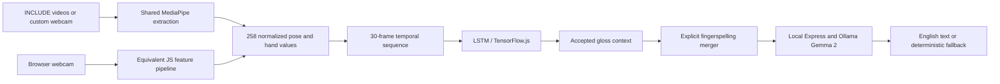

# Sanket ISL Translator

Sanket is an Indian Sign Language (ISL) to English research prototype using computer vision and deep learning. It classifies selected signs from webcam landmarks, then sends accepted glosses to a local sentence-generation service. It is not unrestricted conversational interpretation.

- [Architecture](docs/architecture.md) and [canonical landmark specification](docs/landmark-schema.md)
- [Custom recording and INCLUDE preparation](docs/custom-dataset.md)
- [Training](docs/training.md), [evaluation](docs/evaluation.md), [audit](docs/audit/repository-audit.md)
- [Final implementation verification](FINAL_AUDIT.md)
- [263 shipped labels](docs/vocabulary.md); label availability does not imply reliable recognition


The screenshot predates the pipeline corrections and is an interface illustration, not recognition evidence.

## Pipeline



Pose contributes 33 × 4 values; each hand contributes 21 × 3. Face is excluded from the classifier. All numeric transforms are versioned, validated and tested between Python and JavaScript. Browser smoothing affects overlays only. Existing 1692-wide NPY data requires explicit legacy conversion or preferably source-video re-extraction; unknown provenance is never silently treated as verified.

## Run locally

Use Node.js 22.12+ and npm. From the repository root, in separate terminals:

```bash
npm --prefix apps/backend ci
npm --prefix apps/backend start
```

```bash
npm --prefix apps/frontend ci
npm --prefix apps/frontend run dev
```

For local model-backed sentence generation:

```bash
ollama serve
ollama pull gemma2:2b
```

Ollama model acquisition needs a network connection. If Ollama is unavailable, the backend provides basic deterministic formatting. The backend listens on `127.0.0.1:3001`; the browser processes video locally and submits gloss text. MediaPipe assets and fonts still require external downloads, so fully offline operation is not claimed.

## Live and demo behavior

Grant camera permission and wait for model loading. Arm **Record Next Sign**, perform one complete sign, then stop or let enabled dynamic capture stop after sustained low motion. Short captures are rejected. Review RECOGNIZED or UNCERTAIN status, then **Finish & Translate**. The original .40 confidence threshold remains uncalibrated; higher softmax confidence is not a guarantee of correctness.

**Spell Name** submits a typed fingerspelling group. `U → J → J → W → A → L` becomes `Ujjwal`; repeated letters are preserved. This is manual name input, not a claim of validated alphabet recognition. The API also supports explicit acronym groups.

Demo Mode displays scripted words and sentences from local media. **Demo Mode is not live model evaluation.** Switching modes stops the live camera and closes its models. Production builds exclude demo footage. Experimental eyebrow/question detection is off by default.

## Data, training and tests

Use Python 3.11:

```bash
python -m venv .venv
.venv/bin/pip install -r ml/requirements-training.txt
.venv/bin/python -m ml.src.data.data_collection --camera 0 --label hello --samples 100 --signer-id signer-01
.venv/bin/python -m ml.src.data.process_include --videos /path/to/include --output data/include
.venv/bin/python -m ml.src.data.validate_dataset data/include data/custom
.venv/bin/python -m ml.src.training.train_lstm data/include data/custom --output models/candidates/run-01
```

Training splits recordings, duplicates and known signers before augmentation, reserves validation and test partitions, and writes a new candidate directory. It does not overwrite shipped models. See [dataset instructions](docs/custom-dataset.md) and [training details](docs/training.md), including source balancing and unknown signer limitations.

```bash
.venv/bin/python -m unittest discover -s tests/ml -v
npm --prefix apps/frontend test
npm --prefix apps/backend test
npm --prefix apps/frontend run lint
npm --prefix apps/frontend run build
npm --prefix apps/frontend run check:discoverability
```

The optional real-video test requires `SANKET_VIDEO_TEST=/path/to/sign-video`. The browser lifecycle test uses a separate headless Chromium with synthetic camera; commands and results are in [FINAL_AUDIT.md](FINAL_AUDIT.md).

## Repository layout

`apps/frontend` and `apps/backend` contain runtime applications. `ml/src` contains preprocessing, data, training, evaluation and Python diagnostic inference. `models` contains deployed artifacts and evaluation records. `data` stores canonical samples locally. `tests` is separated by ML/frontend/backend; `docs` contains specifications and audits. No folder flattening or aesthetic relocation is required.

## Evidence and limitations

The legacy report's rounded 98% score is affected by augmentation leakage and validation reuse; it is not a supported live or signer-independent result. Shipped weights are preserved. New smoke training verifies code paths only. Mathematical parity and successful model loading do not establish recognition quality.

Legacy source/signer/mirroring provenance remains unknown. Detector anatomical-side validation, diverse real-user webcam evaluation, confidence calibration on unknown signs, full verified-data retraining and comprehensive signer balancing remain open. No physical webcam was available during automated verification. Generated English can alter meaning and should be reviewed.

The original [INCLUDE metadata](zenodo_files.json) and [dataset discussion](docs/dataset.md) describe source references. Historical landmark files already tracked by Git were retained; ignore rules do not remove them. This repository does not add new licensing claims for code, models or media.

For deployment and static documentation, see [installation](docs/installation.md), [deployment](docs/deployment.md) and [documentation index](docs/index.md). The GitHub repository is [ujjwal-tiwari3039/Sanket-ISL-translator](https://github.com/ujjwal-tiwari3039/Sanket-ISL-translator). No public deployment was performed.
