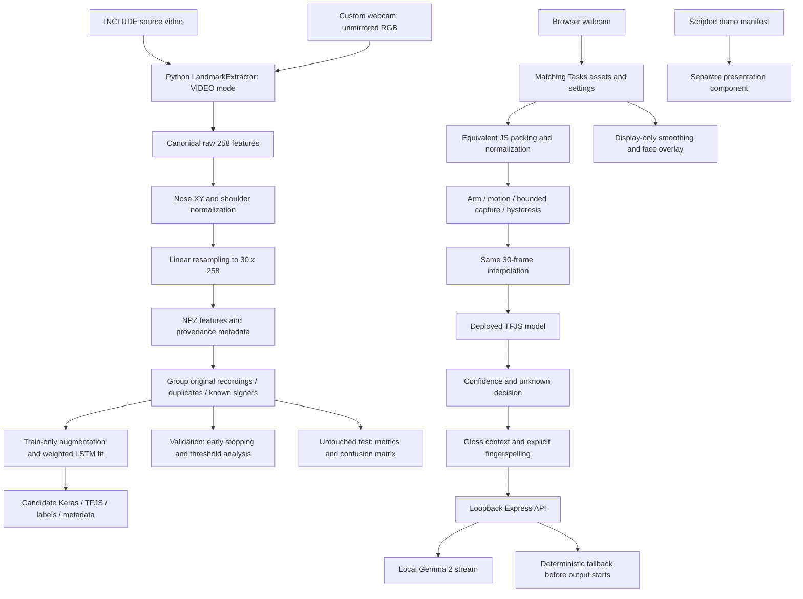

# System architecture

Sanket separates gesture recognition from language generation. Folder boundaries remain `apps/`, `ml/`, `models/`, `data/`, `docs/` and `tests/`.

Python numeric preprocessing is import-safe under `ml/src/preprocessing`. Dataset metadata prevents silent profile mixing. Browser `App.jsx` imports the tested pure utilities; it no longer maintains duplicate normalization/resampling code. App mounts either live or demo so camera/model ownership is explicit. Face data never enters the LSTM; the separate question heuristic requires an experimental opt-in.

The candidate exporter never replaces deployed files automatically. Both shipped and candidate export predictions were compared across Keras and TFJS. The shipped model still has legacy training provenance; it is not retroactively certified by the new pipeline.

The browser sends only text tokens to `http://127.0.0.1:3001/api/assemble`. Express binds loopback and calls local `gemma2:2b` at port 11434 with timeout/cancellation. External MediaPipe assets/fonts prevent a verified offline claim. Demo overlays can use MediaPipe, but words and final sentences come from the manifest.

See [schema](landmark-schema.md), [capture](temporal-segmentation.md), [data](custom-dataset.md), [training](training.md), and [evaluation](evaluation.md).
