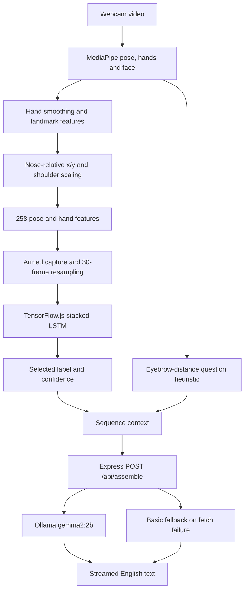

# System architecture

Sanket ISL Translator separates browser recognition from sentence assembly. The browser uses React 19, MediaPipe Tasks Vision and TensorFlow.js. A Node.js Express 4 service forwards recognized text to local Ollama.

## Live processing path

The same path in text: webcam → landmarks → spatial normalization → fixed-length temporal sequence → LSTM class probabilities → label queue → sentence generation → English text. Face coordinates are excluded from classifier input; a separate facial heuristic can add a question marker.

## Component boundaries

- `frontend/src/App.jsx`: camera lifecycle, MediaPipe loading, feature extraction, capture state, classification and sentence display.
- `frontend/src/DemoMode.jsx`: presentation playback. Words, confidence values and final sentences come from the demo manifest, not live classification.
- `apps/backend/server.js`: `POST /api/assemble`, letter merging, Ollama streaming and fallback formatting.
- `ml/src/preprocessing/keypoint_extractor.py` and collection scripts: Python landmark extraction.
- `ml/src/training/train_lstm.py`: augmentation, fitting, artifact export and evaluation.
- `frontend/public/models/`: deployed classifier topology, weights and ordered labels.

## Network boundaries

The frontend currently posts text to `http://localhost:3001/api/assemble`; this means the visitor's machine when the site is public. The backend calls `http://127.0.0.1:11434/api/generate`. MediaPipe WASM and task models load from jsDelivr and Google Storage. Google Fonts is also requested by application CSS. A static deployment alone does not provide a hosted sentence-generation backend.

See [preprocessing](preprocessing.md), [model](model.md), [inference](inference.md) and [deployment](deployment.md).

## Source evidence

- [frontend/src/App.jsx](../apps/frontend/src/App.jsx)
- [frontend/src/DemoMode.jsx](../apps/frontend/src/DemoMode.jsx)
- [backend/server.js](../apps/backend/server.js)
