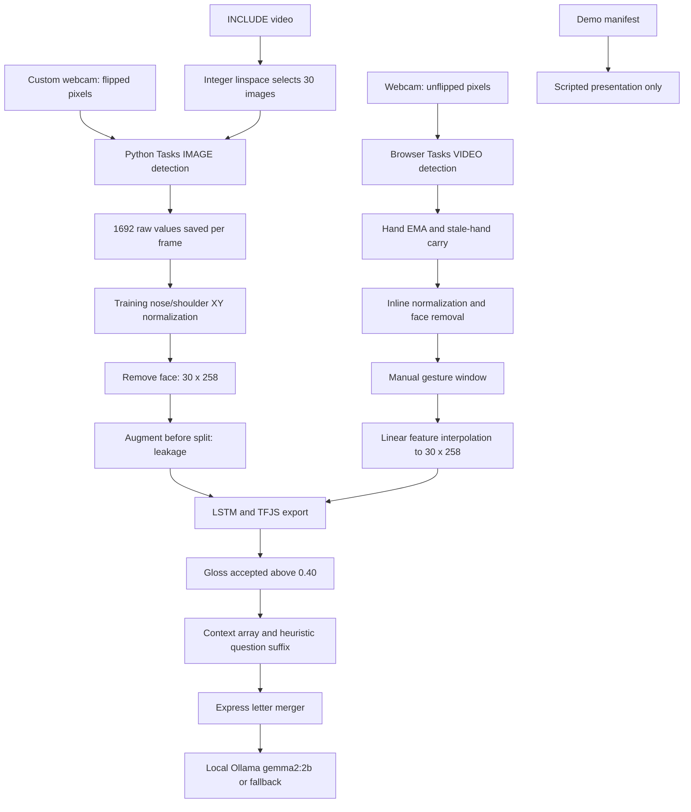

# Phase 0: execution and representation audit

## Current paths

## Stage contracts and failure mechanisms

| Stage | Input → output | Coordinates / transformation | Assumptions and loss |
|---|---|---|---|
| INCLUDE decode | Video → list of BGR images → 30 RGB images | Pixel array; floor-like integer linspace across entire clip | All decoded frames held in RAM. Source fps/timestamps and discarded frames lost; short clips repeat frames. |
| Custom recording | Camera → 30 RGB images | Horizontal flip **before** detection | Fixed capture count with compute/wait delays, no measured timestamps; overwrites numbered takes; no source/signer record. |
| Python Tasks | RGB → pose/face/hand result objects | Normalized image landmarks; world outputs unused | IMAGE mode defaults, unlike live tracking. First pose/face only. Independent detectors need not associate hands to same person. |
| Packing | Result objects → `(1692,)` | Pose XY Z visibility, face XYZ, Left XYZ, Right XYZ | Zero slots for missing groups; no shape/finite validation. Duplicate side labels overwrite. |
| Training normalization | Raw vector → `(258,)` | XY minus nose divided by 2D shoulder width; z/visibility unchanged; face dropped | Missing nose zeros entire frame. Bad anchor visibility unhandled. Face cannot inform classifier. |
| Training windows | Files 0…29 → `(N,30,258)` | No temporal reconstruction beyond saved frames | Missing files silently zero padded, provenance ignored; accepts any numeric directory as sample. |
| Augmentation | Window → original + 7 variants | Noise/scale/warp/trim/mirror | Visibility jittered/scaled; missingness can be interpolated; mirror swaps hands but not paired pose indices. |
| Browser detector | Video → landmark results, roughly ≤15 Hz | VIDEO mode; raw pixels unflipped by CSS | JS SDK and WASM versions differ; actual sampling varies with compute latency. |
| Browser hand preprocessing | Results → persistent hand list | EMA alpha .65; carry up to 3 missed frames | Missing hands not zeroed immediately; fallback matching can blend opposite hands. Drawing mutates inference state. |
| Browser capture | `(258,)` frames → variable-length buffer | Velocity is summed image-space XY displacement over wrist/tips | No elapsed-time/scale/hand-count normalization. Trigger ≥.030; onset frame not appended on ARMED transition. Manual stop only; empty stop does nothing; one-frame capture can be padded and classified. |
| Browser resampling | `T x 258` → `30 x 258` | Linear interpolation at `t*(T-1)/29` | Unlike integer source-image sampling. Interpolates visibility and missing landmarks; no real timestamps. |
| Prediction | `(1,30,258)` → `(1,263)` | Softmax | Shape/label/finite checks absent in live code; threshold .40 not calibrated, no margin or consensus gate. |
| Context | Accepted labels → array | Optional `?`, manually entered uppercase letters | No typed fingerspelling boundaries, duplicate policy or max context; question heuristic may change non-sign labels. |
| Language | JSON sequence → streamed English | Text only, not a tensor | Arrays only checked at outer level; arbitrary values converted to strings; no input vocabulary/length validation, timeout or client disconnect abort. |
| Demo | Manifest → words/confidence/sentence | Timeline divides duration equally among words | Ignores recorded timestamps, no classifier evaluation; generated confidence may be random. |

## Language and lifecycle root causes

Ollama target is fixed to `127.0.0.1:11434/api/generate`, model `gemma2:2b`. Express itself uses `listen(PORT)` without loopback binding and unrestricted CORS. Thus local upstream inference is present, but local-only service exposure is not enforced. Streaming parses newline-delimited JSON; parse errors and upstream error objects can be ignored. Failure after partial output appends a complete fallback to that prefix. Successful empty output is not reliably distinguished from a useful sentence. Fallback only formats token order, lowercases names/acronyms and has an incomplete question-word list.

App's conditional Demo return does not unmount App or rerun its `[]` camera effect. Parent stream and landmarkers remain allocated. Demo adds its own landmarkers, never closes them, and does not cancel typing timers. StrictMode repeats setup/cleanup in development, making uncancelled initialization especially relevant. These are ownership defects; moving folders would not fix them.

## Required parity boundary

Parity must include packing, absent pose/hands, handedness conflicts, normalization and temporal resampling in the actual imported browser path, not merely duplicate utility functions. A 258-vector match cannot prove detector equivalence when source images were mirrored, sampled differently or processed with IMAGE versus VIDEO tracking. Separate mathematical parity fixtures from camera-domain evaluation.
